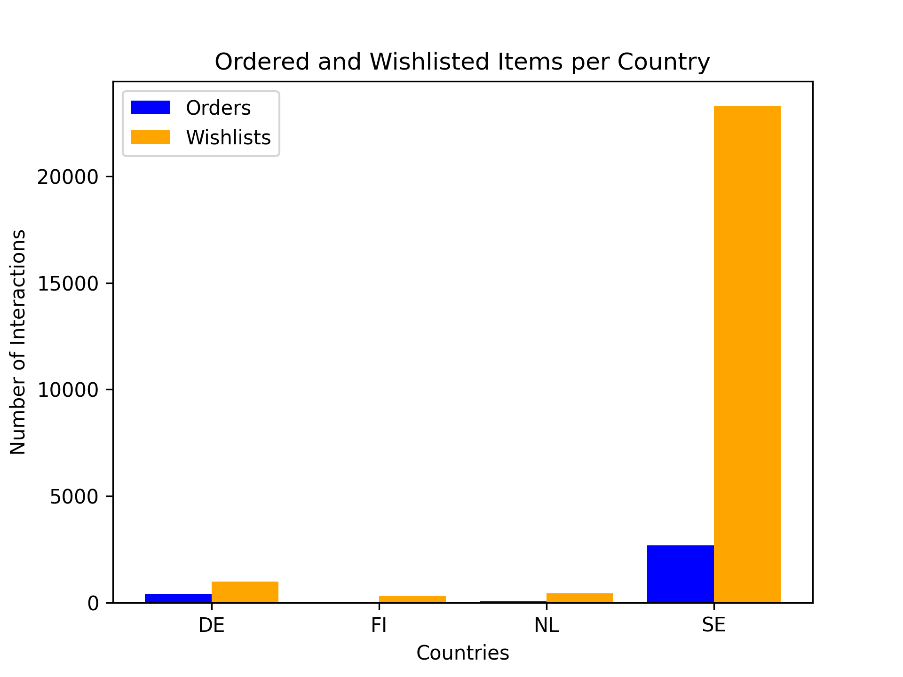

# Recommendation System

## Setup

1.  **Clone the repository:**

    ```bash
    git clone https://github.com/anton-bergman/sellpy-case.git
    cd sellpy-case
    ```

2.  **Set up virtual environment and install the required packages:**

    ```bash
    python3 -m venv .venv
    source .venv/bin/activate
    pip install -r requirements.txt
    ```

## Task 1

Task 1 answers the data exploration questions. To obtain these answers, execute the corresponding Python script in the terminal.

1.  **Which user has made the most wishlist interactions?**

    - **Answer:**

      ```bash
      User with the most wishlist interactions: 01d8CuzSnr
      Number of wishlist interactions: 3225
      ```

    - **Solution:** The script calculates the number of "wishlist" interactions for each user from the `user_item_interactions.csv` file and identifies the user with the max number of such interactions.

    - To get the answer, run:
      ```bash
      python task1_q1.py
      ```

2.  **Which are the top 3 most popular item categories among the interactions?**

    - **Answer:**

      ```bash
      Category interactions: [('Clothing > Dresses > Dresses', 2547), ('Clothing > Sweaters & Cardigans > Sweaters', 1744), ('Clothing > Tops', 1602)]
      ```

    - **Solution:** The script calculates the top 3 most popular item categories in `user_item_interactions.csv` by joining the user-item interaction data with item data in `item_data_for_interactions.csv` and counting category occurrences.

    - To get the answer, run:
      ```bash
      python task1_q2.py
      ```

3.  **What is the share of German (DE) users?**

    - **Answer:**

      ```bash
      Number of users from Germany: 19
      # Note: We have been given the total number of users which is 100,
      # therefore the share of German (DE) users is 19/100 = 0.19
      ```

    - **Solution:** The script reads the `user_features.csv` file and counts the number of users with the country code "DE".

    - To get the answer, run:
      ```bash
      python task1_q3.py
      ```

4.  **How large a share of the users are interested in Kids clothes according to the user features? How many of them are mainly interested in Kids clothes?**

    - **Answer:**

      ```bash
      Number of users with 'Kids' interest: 51
      Number of users with 'Kids' as main interest: 11
      # Note: We have been given the total number of users which is 100,
      # therefore the share of users interested in the demography 'Kids' is 51/100 = 0.51,
      # and the share of users having it as their main interest is 11/100 = 0.11
      ```

    - **Solution:** The script analyzes the `user_features.csv` file, calculating the number of users who has an item "Kids" in their respective demography_array and the number of users for whom it is the primary interest, ie who has the demography "Kids" first in their demography_array.

    - To get the answer, run:
      ```bash
      python task1_q4.py
      ```

5.  **How many live items are there of the type “Jeans”?**

    - **Answer:**

      ```bash
      Number of live items of type 'Jeans': 640
      ```

    - **Solution:** The script reads the `live_item_data.csv` file and counts the number of items with the "type" metadata field set to "Jeans".

    - To get the answer, run:
      ```bash
      python task1_q5.py
      ```

6.  **Create a visualization of the number of items bought and wishlisted per user country.**

    - **Answer:**
      

      ```bash
      Ordered and wishlisted items per country: {'order': {'DE': 406, 'FI': 11, 'NL': 66, 'SE': 2678}, 'wishlist': {'DE': 983, 'FI': 291, 'NL': 427, 'SE': 23295}}
      Countries: ['DE', 'FI', 'NL', 'SE']
      Orders: [406, 11, 66, 2678]
      Wishlists: [983, 291, 427, 23295]
      ```

    - **Solution:** The script generates a grouped bar chart visualizing the number of orders and wishlists per user country using data from `user_item_interactions.csv` and `user_features.csv`.

    - To get the answer, run
      ```bash
      python task1_q6.py
      ```

## Task 2

Task 2 implements a recommendation system with the ability to train and evaluate different models (Linear Regression, User-Item Similarity and Multi-Layer Perceptron (MLP)). The system supports training on both the full dataset and a split dataset, as well as loading pre-trained models. Evaluation can be performed on either the user-item interactions test set or a live item dataset.

### Usage

The main script is `task2.py`. You can run it directly using the Python interpreter. The script is designed to be configured through the following Enums within the script:

#### Configuration Enums

- **`ModelType`**: Selects the recommendation model.

  - `MLP`: Multi-Layer Perceptron model.
  - `LINEAR_REGRESSION`: Linear Regression model.
  - `USER_ITEM_SIMILARITY`: User-Item Similarty based model.

- **`Mode`**: Determines the training/loading mode.
  - `TRAIN_ON_FULL_DATA`: Train the model on the entire `user_item_interactions.csv` dataset.
  - `TRAIN_ON_SPLIT_DATA`: Train the model on a split of the `user_item_interactions.csv` dataset (80% train, 20% test).
  - `LOAD_MODEL_FOR_FULL_DATA`: Load a pre-trained model that was trained on the full dataset and evaluate on the `live_item_data.csv` dataset.
  - `LOAD_MODEL_FOR_SPLIT_DATA`: Load a pre-trained model that was trained on the split dataset and evaluate on the test split of `user_item_interactions.csv`.

#### Running Task 2

1.  **Open `task2.py`:** Review the script to set the desired configuration. Specifically, modify these lines:

    ```python
    MODEL = ModelType.USER_ITEM_SIMILARITY  # Change to select the model
    MODE = Mode.LOAD_MODEL_FOR_FULL_DATA  # Change to select the mode
    TOP_N_RECOMMENDATIONS = 10  # Change to the number of top recommendations you want to see
    USER_OBJECTID = "00k2cfIsKw"  # Change to the user you want to evaluate
    ```

2.  **Run the script:**
    ```bash
    python task2.py
    ```

### Output

The script will:

- Load the necessary data.
- Preprocess the data.
- Train or load the specified model.
- Evaluate the model.
- Print the top N recommendations for the specified user.

### Model Saving

- If you train a model, it will be saved to the `./saved_models/` directory. The filename will depend on the model type (e.g., `MLP_model_full_data.pth`, `linear_regression_model_split_data.pkl`).
- The script will attempt to load models from this directory if the `MODE` is set to load.

### Answers

#### MLP

1.  Ordered recommendations for user `00k2cfIsKw`:

    ```python
    ['006kWc5eAJ', '02VKaNCDOI', '012OTXQwjT', '008p9xonSn', '00AgUuWStc', '01Q6vJ9sN2', '01JcDeEyex', '011XUHF73W', '013gDsGUKY', '01dsexM2es']
    ```

     <details>
       <summary>
         Raw output
       </summary>

         (.venv) ~/Playground/sellpy-case git:(main*) ❯ python task2.py
         Model loaded from './saved_models/MLP_model_full_data.pth'

         Recommendation 1 for user 00k2cfIsKw: {'item_objectid': '006kWc5eAJ', 'score': 0.3947105407714844}
         User 00k2cfIsKw has the following relevant features for item 006kWc5eAJ: {"user_demography_['Boys']": 0.0, "user_brand_['Newbie By Kappahl']": 0.0}
         User 00k2cfIsKw has 3 previous interactions with: Boys.
         User 00k2cfIsKw has 0 previous interactions with: Newbie By Kappahl.

         Recommendation 2 for user 00k2cfIsKw: {'item_objectid': '02VKaNCDOI', 'score': 0.389484167098999}
         User 00k2cfIsKw has the following relevant features for item 02VKaNCDOI: {"user_demography_['Unisex (Kids)']": 0.0, "user_brand_['Everest']": 0.0}
         User 00k2cfIsKw has 0 previous interactions with: Unisex (Kids).
         User 00k2cfIsKw has 0 previous interactions with: Everest.

         Recommendation 3 for user 00k2cfIsKw: {'item_objectid': '012OTXQwjT', 'score': 0.38924047350883484}
         User 00k2cfIsKw has the following relevant features for item 012OTXQwjT: {"user_demography_['Unisex (Adults)']": 0.0, "user_brand_['Adidas']": 0.0}
         User 00k2cfIsKw has 0 previous interactions with: Unisex (Adults).
         User 00k2cfIsKw has 0 previous interactions with: Adidas.

         Recommendation 4 for user 00k2cfIsKw: {'item_objectid': '008p9xonSn', 'score': 0.3889305591583252}
         User 00k2cfIsKw has the following relevant features for item 008p9xonSn: {"user_demography_['Women']": 0.0, "user_brand_['H&M Coachella']": 0.0}
         User 00k2cfIsKw has 11 previous interactions with: Women.
         User 00k2cfIsKw has 0 previous interactions with: H&M Coachella.

         Recommendation 5 for user 00k2cfIsKw: {'item_objectid': '00AgUuWStc', 'score': 0.38884782791137695}
         User 00k2cfIsKw has the following relevant features for item 00AgUuWStc: {"user_demography_['Women']": 0.0, "user_brand_['Sail Racing']": 0.0}
         User 00k2cfIsKw has 11 previous interactions with: Women.
         User 00k2cfIsKw has 0 previous interactions with: Sail Racing.

         Recommendation 6 for user 00k2cfIsKw: {'item_objectid': '01Q6vJ9sN2', 'score': 0.387899249792099}
         User 00k2cfIsKw has the following relevant features for item 01Q6vJ9sN2: {"user_demography_['Unisex (Adults)']": 0.0, "user_brand_['Adidas']": 0.0}
         User 00k2cfIsKw has 0 previous interactions with: Unisex (Adults).
         User 00k2cfIsKw has 0 previous interactions with: Adidas.

         Recommendation 7 for user 00k2cfIsKw: {'item_objectid': '01JcDeEyex', 'score': 0.38720303773880005}
         User 00k2cfIsKw has the following relevant features for item 01JcDeEyex: {"user_demography_['Women']": 0.0, "user_brand_['KappAhl']": 0.0}
         User 00k2cfIsKw has 11 previous interactions with: Women.
         User 00k2cfIsKw has 0 previous interactions with: KappAhl.

         Recommendation 8 for user 00k2cfIsKw: {'item_objectid': '011XUHF73W', 'score': 0.3868074417114258}
         User 00k2cfIsKw has the following relevant features for item 011XUHF73W: {"user_demography_['Women']": 0.0, "user_brand_['Saint Tropez']": 0.0}
         User 00k2cfIsKw has 11 previous interactions with: Women.
         User 00k2cfIsKw has 0 previous interactions with: Saint Tropez.

         Recommendation 9 for user 00k2cfIsKw: {'item_objectid': '013gDsGUKY', 'score': 0.38594794273376465}
         User 00k2cfIsKw has the following relevant features for item 013gDsGUKY: {"user_demography_['Women']": 0.0, "user_brand_['L.O.G.G by H&M']": 0.0}
         User 00k2cfIsKw has 11 previous interactions with: Women.
         User 00k2cfIsKw has 0 previous interactions with: L.O.G.G by H&M.

         Recommendation 10 for user 00k2cfIsKw: {'item_objectid': '01dsexM2es', 'score': 0.385418564081192}
         User 00k2cfIsKw has the following relevant features for item 01dsexM2es: {"user_demography_['Women']": 0.0, "user_brand_['KappAhl']": 0.0}
         User 00k2cfIsKw has 11 previous interactions with: Women.
         User 00k2cfIsKw has 0 previous interactions with: KappAhl.

     </details>

2.  Ordered recommendations for user `003shjZWGk`:

    ```python
    ['006kWc5eAJ', '02l2MTTTIF', '02wJnEIEHF', '04Dn6VjTrM', '03m2TDaRip', '02VKaNCDOI', '06cRKCCOA6', '06Bmwkt1Vu', '07Hd7DMxEU', '075NxcNQD8']
    ```

    <details>
      <summary>
        Raw output
      </summary>

        (.venv) ~/Playground/sellpy-case git:(main*) ❯ python task2.py
        Model loaded from './saved_models/MLP_model_full_data.pth'

        Recommendation 1 for user 003shjZWGk: {'item_objectid': '006kWc5eAJ', 'score': 0.38385987281799316}
        User 003shjZWGk has the following relevant features for item 006kWc5eAJ: {"user_demography_['Boys']": 0.0, "user_brand_['Newbie By Kappahl']": 0.0}
        User 003shjZWGk has 2 previous interactions with: Boys.
        User 003shjZWGk has 0 previous interactions with: Newbie By Kappahl.

        Recommendation 2 for user 003shjZWGk: {'item_objectid': '02l2MTTTIF', 'score': 0.3796793818473816}
        User 003shjZWGk has the following relevant features for item 02l2MTTTIF: {"user_demography_['Women']": 1.0, "user_brand_['Odd Molly']": 0.0}
        User 003shjZWGk has 86 previous interactions with: Women.
        User 003shjZWGk has 0 previous interactions with: Odd Molly.

        Recommendation 3 for user 003shjZWGk: {'item_objectid': '02wJnEIEHF', 'score': 0.3796767592430115}
        User 003shjZWGk has the following relevant features for item 02wJnEIEHF: {"user_demography_['No demography']": 0.0, "user_brand_['Ponto Pocket']": 0.0}
        User 003shjZWGk has 9 previous interactions with: No demography.
        User 003shjZWGk has 0 previous interactions with: Ponto Pocket.

        Recommendation 4 for user 003shjZWGk: {'item_objectid': '04Dn6VjTrM', 'score': 0.37965255975723267}
        User 003shjZWGk has the following relevant features for item 04Dn6VjTrM: {"user_demography_['Unisex (Kids)']": 0.0, "user_brand_['Name It']": 0.0}
        User 003shjZWGk has 0 previous interactions with: Unisex (Kids).
        User 003shjZWGk has 0 previous interactions with: Name It.

        Recommendation 5 for user 003shjZWGk: {'item_objectid': '03m2TDaRip', 'score': 0.37964627146720886}
        User 003shjZWGk has the following relevant features for item 03m2TDaRip: {"user_demography_['Unisex (Adults)']": 0.0, "user_brand_['No brand']": 0.0}
        User 003shjZWGk has 3 previous interactions with: Unisex (Adults).
        User 003shjZWGk has 11 previous interactions with: No brand.

        Recommendation 6 for user 003shjZWGk: {'item_objectid': '02VKaNCDOI', 'score': 0.3796190619468689}
        User 003shjZWGk has the following relevant features for item 02VKaNCDOI: {"user_demography_['Unisex (Kids)']": 0.0, "user_brand_['Everest']": 0.0}
        User 003shjZWGk has 0 previous interactions with: Unisex (Kids).
        User 003shjZWGk has 0 previous interactions with: Everest.

        Recommendation 7 for user 003shjZWGk: {'item_objectid': '06cRKCCOA6', 'score': 0.3796125650405884}
        User 003shjZWGk has the following relevant features for item 06cRKCCOA6: {"user_demography_['No demography']": 0.0, "user_brand_['No brand']": 0.0}
        User 003shjZWGk has 9 previous interactions with: No demography.
        User 003shjZWGk has 11 previous interactions with: No brand.

        Recommendation 8 for user 003shjZWGk: {'item_objectid': '06Bmwkt1Vu', 'score': 0.3795996308326721}
        User 003shjZWGk has the following relevant features for item 06Bmwkt1Vu: {"user_demography_['Boys']": 0.0, "user_brand_['Newborn by Lindex']": 0.0}
        User 003shjZWGk has 2 previous interactions with: Boys.
        User 003shjZWGk has 0 previous interactions with: Newborn by Lindex.

        Recommendation 9 for user 003shjZWGk: {'item_objectid': '07Hd7DMxEU', 'score': 0.3795792758464813}
        User 003shjZWGk has the following relevant features for item 07Hd7DMxEU: {"user_demography_['Women']": 1.0, "user_brand_['No brand']": 0.0}
        User 003shjZWGk has 86 previous interactions with: Women.
        User 003shjZWGk has 11 previous interactions with: No brand.

        Recommendation 10 for user 003shjZWGk: {'item_objectid': '075NxcNQD8', 'score': 0.3795768916606903}
        User 003shjZWGk has the following relevant features for item 075NxcNQD8: {"user_demography_['Women']": 1.0, "user_brand_['FB Sister']": 0.0}
        User 003shjZWGk has 86 previous interactions with: Women.
        User 003shjZWGk has 0 previous interactions with: FB Sister.

    </details>

3.  Ordered recommendations for user `00GV5UFSoZ`:

    ```python
    ['006kWc5eAJ', '02VKaNCDOI', '00AgUuWStc', '008p9xonSn', '012OTXQwjT', '01Q6vJ9sN2', '01JcDeEyex', '011XUHF73W', '013gDsGUKY', '01dsexM2es']
    ```

    <details>
      <summary>
        Raw output
      </summary>

        (.venv) ~/Playground/sellpy-case git:(main*) ❯ python task2.py
        Model loaded from './saved_models/MLP_model_full_data.pth'

        Recommendation 1 for user 00GV5UFSoZ: {'item_objectid': '006kWc5eAJ', 'score': 0.3905317783355713}
        User 00GV5UFSoZ has the following relevant features for item 006kWc5eAJ: {"user_demography_['Boys']": 0.0, "user_brand_['Newbie By Kappahl']": 0.0}
        User 00GV5UFSoZ has 0 previous interactions with: Boys.
        User 00GV5UFSoZ has 0 previous interactions with: Newbie By Kappahl.

        Recommendation 2 for user 00GV5UFSoZ: {'item_objectid': '02VKaNCDOI', 'score': 0.38563814759254456}
        User 00GV5UFSoZ has the following relevant features for item 02VKaNCDOI: {"user_demography_['Unisex (Kids)']": 0.0, "user_brand_['Everest']": 0.0}
        User 00GV5UFSoZ has 0 previous interactions with: Unisex (Kids).
        User 00GV5UFSoZ has 0 previous interactions with: Everest.

        Recommendation 3 for user 00GV5UFSoZ: {'item_objectid': '00AgUuWStc', 'score': 0.38428017497062683}
        User 00GV5UFSoZ has the following relevant features for item 00AgUuWStc: {"user_demography_['Women']": 0.0, "user_brand_['Sail Racing']": 0.0}
        User 00GV5UFSoZ has 34 previous interactions with: Women.
        User 00GV5UFSoZ has 1 previous interactions with: Sail Racing.

        Recommendation 4 for user 00GV5UFSoZ: {'item_objectid': '008p9xonSn', 'score': 0.3839377760887146}
        User 00GV5UFSoZ has the following relevant features for item 008p9xonSn: {"user_demography_['Women']": 0.0, "user_brand_['H&M Coachella']": 0.0}
        User 00GV5UFSoZ has 34 previous interactions with: Women.
        User 00GV5UFSoZ has 0 previous interactions with: H&M Coachella.

        Recommendation 5 for user 00GV5UFSoZ: {'item_objectid': '012OTXQwjT', 'score': 0.3839300870895386}
        User 00GV5UFSoZ has the following relevant features for item 012OTXQwjT: {"user_demography_['Unisex (Adults)']": 0.0, "user_brand_['Adidas']": 0.0}
        User 00GV5UFSoZ has 0 previous interactions with: Unisex (Adults).
        User 00GV5UFSoZ has 0 previous interactions with: Adidas.

        Recommendation 6 for user 00GV5UFSoZ: {'item_objectid': '01Q6vJ9sN2', 'score': 0.382671058177948}
        User 00GV5UFSoZ has the following relevant features for item 01Q6vJ9sN2: {"user_demography_['Unisex (Adults)']": 0.0, "user_brand_['Adidas']": 0.0}
        User 00GV5UFSoZ has 0 previous interactions with: Unisex (Adults).
        User 00GV5UFSoZ has 0 previous interactions with: Adidas.

        Recommendation 7 for user 00GV5UFSoZ: {'item_objectid': '01JcDeEyex', 'score': 0.3824623227119446}
        User 00GV5UFSoZ has the following relevant features for item 01JcDeEyex: {"user_demography_['Women']": 0.0, "user_brand_['KappAhl']": 0.0}
        User 00GV5UFSoZ has 34 previous interactions with: Women.
        User 00GV5UFSoZ has 0 previous interactions with: KappAhl.

        Recommendation 8 for user 00GV5UFSoZ: {'item_objectid': '011XUHF73W', 'score': 0.38198238611221313}
        User 00GV5UFSoZ has the following relevant features for item 011XUHF73W: {"user_demography_['Women']": 0.0, "user_brand_['Saint Tropez']": 0.0}
        User 00GV5UFSoZ has 34 previous interactions with: Women.
        User 00GV5UFSoZ has 0 previous interactions with: Saint Tropez.

        Recommendation 9 for user 00GV5UFSoZ: {'item_objectid': '013gDsGUKY', 'score': 0.38132718205451965}
        User 00GV5UFSoZ has the following relevant features for item 013gDsGUKY: {"user_demography_['Women']": 0.0, "user_brand_['L.O.G.G by H&M']": 0.0}
        User 00GV5UFSoZ has 34 previous interactions with: Women.
        User 00GV5UFSoZ has 2 previous interactions with: L.O.G.G by H&M.

        Recommendation 10 for user 00GV5UFSoZ: {'item_objectid': '01dsexM2es', 'score': 0.3807401657104492}
        User 00GV5UFSoZ has the following relevant features for item 01dsexM2es: {"user_demography_['Women']": 0.0, "user_brand_['KappAhl']": 0.0}
        User 00GV5UFSoZ has 34 previous interactions with: Women.
        User 00GV5UFSoZ has 0 previous interactions with: KappAhl.

    </details>

#### Linear Regression

1.  Ordered recommendations for user `00k2cfIsKw`:

    ```python
    ['ks5pmrXCWZ', 'iViPEUzCxR', '6jUEY0lyd1', 'veNWEgd5Iy', 'EeXOkvw3XP', '99w77Tl6Ju', '9qvoiqbdVU', 'H6AoXtneh0', 'hngyZEvo4e', 'AMsbsFmxeF']
    ```

    <details>
      <summary>
        Raw output
      </summary>

        (.venv) ~/Playground/sellpy-case git:(main*) ❯ python task2.py
        Model loaded from './saved_models/linear_regression_model_full_data.pkl'

        Recommendation 1 for user 00k2cfIsKw: {'item_objectid': 'ks5pmrXCWZ', 'score': 1.1016753218431656}
        User 00k2cfIsKw has the following relevant features for item ks5pmrXCWZ: {"user_demography_['Men']": 0.15, "user_brand_['Take Off']": 0.0}
        User 00k2cfIsKw has 2 previous interactions with: Men.
        User 00k2cfIsKw has 0 previous interactions with: Take Off.

        Recommendation 2 for user 00k2cfIsKw: {'item_objectid': 'iViPEUzCxR', 'score': 1.09253796740013}
        User 00k2cfIsKw has the following relevant features for item iViPEUzCxR: {"user_demography_['Women']": 0.0, "user_brand_['Joy']": 0.0}
        User 00k2cfIsKw has 11 previous interactions with: Women.
        User 00k2cfIsKw has 0 previous interactions with: Joy.

        Recommendation 3 for user 00k2cfIsKw: {'item_objectid': '6jUEY0lyd1', 'score': 1.0909159696145299}
        User 00k2cfIsKw has the following relevant features for item 6jUEY0lyd1: {"user_demography_['Men']": 0.15, "user_brand_['Joy']": 0.0}
        User 00k2cfIsKw has 2 previous interactions with: Men.
        User 00k2cfIsKw has 0 previous interactions with: Joy.

        Recommendation 4 for user 00k2cfIsKw: {'item_objectid': 'veNWEgd5Iy', 'score': 1.0899007604341655}
        User 00k2cfIsKw has the following relevant features for item veNWEgd5Iy: {"user_demography_['Women']": 0.0, "user_brand_['Shaping New Tomorrow']": 0.0}
        User 00k2cfIsKw has 11 previous interactions with: Women.
        User 00k2cfIsKw has 0 previous interactions with: Shaping New Tomorrow.

        Recommendation 5 for user 00k2cfIsKw: {'item_objectid': 'EeXOkvw3XP', 'score': 1.0876558823479296}
        User 00k2cfIsKw has the following relevant features for item EeXOkvw3XP: {"user_demography_['Women']": 0.0, "user_brand_['Anna Field Mama']": 0.0}
        User 00k2cfIsKw has 11 previous interactions with: Women.
        User 00k2cfIsKw has 0 previous interactions with: Anna Field Mama.

        Recommendation 6 for user 00k2cfIsKw: {'item_objectid': '99w77Tl6Ju', 'score': 1.0875623436016997}
        User 00k2cfIsKw has the following relevant features for item 99w77Tl6Ju: {"user_demography_['Women']": 0.0, "user_brand_['Anna Field Mama']": 0.0}
        User 00k2cfIsKw has 11 previous interactions with: Women.
        User 00k2cfIsKw has 0 previous interactions with: Anna Field Mama.

        Recommendation 7 for user 00k2cfIsKw: {'item_objectid': '9qvoiqbdVU', 'score': 1.0871091845883987}
        User 00k2cfIsKw has the following relevant features for item 9qvoiqbdVU: {"user_demography_['Men']": 0.15, "user_brand_['Black Squad']": 0.0}
        User 00k2cfIsKw has 2 previous interactions with: Men.
        User 00k2cfIsKw has 0 previous interactions with: Black Squad.

        Recommendation 8 for user 00k2cfIsKw: {'item_objectid': 'H6AoXtneh0', 'score': 1.0544463794235364}
        User 00k2cfIsKw has the following relevant features for item H6AoXtneh0: {"user_demography_['Unisex (Kids)']": 0.0, "user_brand_['Amy & Lucy']": 0.0}
        User 00k2cfIsKw has 0 previous interactions with: Unisex (Kids).
        User 00k2cfIsKw has 0 previous interactions with: Amy & Lucy.

        Recommendation 9 for user 00k2cfIsKw: {'item_objectid': 'hngyZEvo4e', 'score': 1.0402343627196438}
        User 00k2cfIsKw has the following relevant features for item hngyZEvo4e: {"user_demography_['Girls']": 0.0, "user_brand_['Amy & Lucy']": 0.0}
        User 00k2cfIsKw has 6 previous interactions with: Girls.
        User 00k2cfIsKw has 0 previous interactions with: Amy & Lucy.

        Recommendation 10 for user 00k2cfIsKw: {'item_objectid': 'AMsbsFmxeF', 'score': 1.039817744933719}
        User 00k2cfIsKw has the following relevant features for item AMsbsFmxeF: {"user_demography_['Girls']": 0.0, "user_brand_['Amy & Lucy']": 0.0}
        User 00k2cfIsKw has 6 previous interactions with: Girls.
        User 00k2cfIsKw has 0 previous interactions with: Amy & Lucy.

    </details>

2.  Ordered recommendations for user `003shjZWGk`:

    ```python
    ['ks5pmrXCWZ', 'iViPEUzCxR', '6jUEY0lyd1', 'veNWEgd5Iy', 'EeXOkvw3XP', '99w77Tl6Ju', '9qvoiqbdVU', 'H6AoXtneh0', 'hngyZEvo4e', 'AMsbsFmxeF']
    ```

    <details>
      <summary>
        Raw output
      </summary>

        (.venv) ~/Playground/sellpy-case git:(main*) ❯ python task2.py
        Model loaded from './saved_models/linear_regression_model_full_data.pkl'

        Recommendation 1 for user 003shjZWGk: {'item_objectid': 'ks5pmrXCWZ', 'score': 1.0631081346432976}
        User 003shjZWGk has the following relevant features for item ks5pmrXCWZ: {"user_demography_['Men']": 0.0, "user_brand_['Take Off']": 0.0}
        User 003shjZWGk has 8 previous interactions with: Men.
        User 003shjZWGk has 0 previous interactions with: Take Off.

        Recommendation 2 for user 003shjZWGk: {'item_objectid': 'iViPEUzCxR', 'score': 1.053970780200262}
        User 003shjZWGk has the following relevant features for item iViPEUzCxR: {"user_demography_['Women']": 1.0, "user_brand_['Joy']": 0.0}
        User 003shjZWGk has 86 previous interactions with: Women.
        User 003shjZWGk has 0 previous interactions with: Joy.

        Recommendation 3 for user 003shjZWGk: {'item_objectid': '6jUEY0lyd1', 'score': 1.0523487824146618}
        User 003shjZWGk has the following relevant features for item 6jUEY0lyd1: {"user_demography_['Men']": 0.0, "user_brand_['Joy']": 0.0}
        User 003shjZWGk has 8 previous interactions with: Men.
        User 003shjZWGk has 0 previous interactions with: Joy.

        Recommendation 4 for user 003shjZWGk: {'item_objectid': 'veNWEgd5Iy', 'score': 1.0513335732342974}
        User 003shjZWGk has the following relevant features for item veNWEgd5Iy: {"user_demography_['Women']": 1.0, "user_brand_['Shaping New Tomorrow']": 0.0}
        User 003shjZWGk has 86 previous interactions with: Women.
        User 003shjZWGk has 0 previous interactions with: Shaping New Tomorrow.

        Recommendation 5 for user 003shjZWGk: {'item_objectid': 'EeXOkvw3XP', 'score': 1.0490886951480616}
        User 003shjZWGk has the following relevant features for item EeXOkvw3XP: {"user_demography_['Women']": 1.0, "user_brand_['Anna Field Mama']": 0.0}
        User 003shjZWGk has 86 previous interactions with: Women.
        User 003shjZWGk has 0 previous interactions with: Anna Field Mama.

        Recommendation 6 for user 003shjZWGk: {'item_objectid': '99w77Tl6Ju', 'score': 1.0489951564018316}
        User 003shjZWGk has the following relevant features for item 99w77Tl6Ju: {"user_demography_['Women']": 1.0, "user_brand_['Anna Field Mama']": 0.0}
        User 003shjZWGk has 86 previous interactions with: Women.
        User 003shjZWGk has 0 previous interactions with: Anna Field Mama.

        Recommendation 7 for user 003shjZWGk: {'item_objectid': '9qvoiqbdVU', 'score': 1.0485419973885304}
        User 003shjZWGk has the following relevant features for item 9qvoiqbdVU: {"user_demography_['Men']": 0.0, "user_brand_['Black Squad']": 0.0}
        User 003shjZWGk has 8 previous interactions with: Men.
        User 003shjZWGk has 0 previous interactions with: Black Squad.

        Recommendation 8 for user 003shjZWGk: {'item_objectid': 'H6AoXtneh0', 'score': 1.015879192223668}
        User 003shjZWGk has the following relevant features for item H6AoXtneh0: {"user_demography_['Unisex (Kids)']": 0.0, "user_brand_['Amy & Lucy']": 0.0}
        User 003shjZWGk has 0 previous interactions with: Unisex (Kids).
        User 003shjZWGk has 0 previous interactions with: Amy & Lucy.

        Recommendation 9 for user 003shjZWGk: {'item_objectid': 'hngyZEvo4e', 'score': 1.0016671755197755}
        User 003shjZWGk has the following relevant features for item hngyZEvo4e: {"user_demography_['Girls']": 0.0, "user_brand_['Amy & Lucy']": 0.0}
        User 003shjZWGk has 1 previous interactions with: Girls.
        User 003shjZWGk has 0 previous interactions with: Amy & Lucy.

        Recommendation 10 for user 003shjZWGk: {'item_objectid': 'AMsbsFmxeF', 'score': 1.0012505577338506}
        User 003shjZWGk has the following relevant features for item AMsbsFmxeF: {"user_demography_['Girls']": 0.0, "user_brand_['Amy & Lucy']": 0.0}
        User 003shjZWGk has 1 previous interactions with: Girls.
        User 003shjZWGk has 0 previous interactions with: Amy & Lucy.

    </details>

3.  Ordered recommendations for user `00GV5UFSoZ`:

    ```python
    ['ks5pmrXCWZ', 'iViPEUzCxR', '6jUEY0lyd1', 'veNWEgd5Iy', 'EeXOkvw3XP', '99w77Tl6Ju', '9qvoiqbdVU', 'H6AoXtneh0', 'hngyZEvo4e', 'AMsbsFmxeF']
    ```

    <details>
      <summary>
        Raw output
      </summary>

        (.venv) ~/Playground/sellpy-case git:(main*) ❯ python task2.py
        Model loaded from './saved_models/linear_regression_model_full_data.pkl'

        Recommendation 1 for user 00GV5UFSoZ: {'item_objectid': 'ks5pmrXCWZ', 'score': 1.0133916065221296}
        User 00GV5UFSoZ has the following relevant features for item ks5pmrXCWZ: {"user_demography_['Men']": 1.0, "user_brand_['Take Off']": 0.0}
        User 00GV5UFSoZ has 52 previous interactions with: Men.
        User 00GV5UFSoZ has 0 previous interactions with: Take Off.

        Recommendation 2 for user 00GV5UFSoZ: {'item_objectid': 'iViPEUzCxR', 'score': 1.004254252079094}
        User 00GV5UFSoZ has the following relevant features for item iViPEUzCxR: {"user_demography_['Women']": 0.0, "user_brand_['Joy']": 0.0}
        User 00GV5UFSoZ has 34 previous interactions with: Women.
        User 00GV5UFSoZ has 0 previous interactions with: Joy.

        Recommendation 3 for user 00GV5UFSoZ: {'item_objectid': '6jUEY0lyd1', 'score': 1.0026322542934938}
        User 00GV5UFSoZ has the following relevant features for item 6jUEY0lyd1: {"user_demography_['Men']": 1.0, "user_brand_['Joy']": 0.0}
        User 00GV5UFSoZ has 52 previous interactions with: Men.
        User 00GV5UFSoZ has 0 previous interactions with: Joy.

        Recommendation 4 for user 00GV5UFSoZ: {'item_objectid': 'veNWEgd5Iy', 'score': 1.0016170451131292}
        User 00GV5UFSoZ has the following relevant features for item veNWEgd5Iy: {"user_demography_['Women']": 0.0, "user_brand_['Shaping New Tomorrow']": 0.0}
        User 00GV5UFSoZ has 34 previous interactions with: Women.
        User 00GV5UFSoZ has 1 previous interactions with: Shaping New Tomorrow.

        Recommendation 5 for user 00GV5UFSoZ: {'item_objectid': 'EeXOkvw3XP', 'score': 0.9993721670268934}
        User 00GV5UFSoZ has the following relevant features for item EeXOkvw3XP: {"user_demography_['Women']": 0.0, "user_brand_['Anna Field Mama']": 0.0}
        User 00GV5UFSoZ has 34 previous interactions with: Women.
        User 00GV5UFSoZ has 0 previous interactions with: Anna Field Mama.

        Recommendation 6 for user 00GV5UFSoZ: {'item_objectid': '99w77Tl6Ju', 'score': 0.9992786282806634}
        User 00GV5UFSoZ has the following relevant features for item 99w77Tl6Ju: {"user_demography_['Women']": 0.0, "user_brand_['Anna Field Mama']": 0.0}
        User 00GV5UFSoZ has 34 previous interactions with: Women.
        User 00GV5UFSoZ has 0 previous interactions with: Anna Field Mama.

        Recommendation 7 for user 00GV5UFSoZ: {'item_objectid': '9qvoiqbdVU', 'score': 0.9988254692673622}
        User 00GV5UFSoZ has the following relevant features for item 9qvoiqbdVU: {"user_demography_['Men']": 1.0, "user_brand_['Black Squad']": 0.0}
        User 00GV5UFSoZ has 52 previous interactions with: Men.
        User 00GV5UFSoZ has 0 previous interactions with: Black Squad.

        Recommendation 8 for user 00GV5UFSoZ: {'item_objectid': 'H6AoXtneh0', 'score': 0.9661626641025001}
        User 00GV5UFSoZ has the following relevant features for item H6AoXtneh0: {"user_demography_['Unisex (Kids)']": 0.0, "user_brand_['Amy & Lucy']": 0.0}
        User 00GV5UFSoZ has 0 previous interactions with: Unisex (Kids).
        User 00GV5UFSoZ has 0 previous interactions with: Amy & Lucy.

        Recommendation 9 for user 00GV5UFSoZ: {'item_objectid': 'hngyZEvo4e', 'score': 0.9519506473986072}
        User 00GV5UFSoZ has the following relevant features for item hngyZEvo4e: {"user_demography_['Girls']": 0.0, "user_brand_['Amy & Lucy']": 0.0}
        User 00GV5UFSoZ has 0 previous interactions with: Girls.
        User 00GV5UFSoZ has 0 previous interactions with: Amy & Lucy.

        Recommendation 10 for user 00GV5UFSoZ: {'item_objectid': 'AMsbsFmxeF', 'score': 0.9515340296126824}
        User 00GV5UFSoZ has the following relevant features for item AMsbsFmxeF: {"user_demography_['Girls']": 0.0, "user_brand_['Amy & Lucy']": 0.0}
        User 00GV5UFSoZ has 0 previous interactions with: Girls.
        User 00GV5UFSoZ has 0 previous interactions with: Amy & Lucy.

    </details>

#### User-Item Similarity (recommended)

1.  Ordered recommendations for user `00k2cfIsKw`:

    ```python
    ['1HMYEajzlB', '4CtTmmmPqs', '5AHEKV5Gio', '6EIU1YBQK8', '6P5FRWKj19', '86ScCzUJqC', '8vZGHqhjKV', '9bmZF1kEHw', 'A5qbn8IgCF', 'BkqWpBKKBs']
    ```

    <details>
      <summary>
        Raw output
      </summary>

        (.venv) ~/Playground/sellpy-case git:(main\*) ❯ python task2.py

        Recommendation 1 for user 00k2cfIsKw: {'item*objectid': '1HMYEajzlB', 'score': 0.16491016525622285}
        User 00k2cfIsKw has the following relevant features for item 1HMYEajzlB: {"user_demography*['Men']": 0.15, "user*brand*['Cubus']": 0.06}
        User 00k2cfIsKw has 2 previous interactions with: Men.
        User 00k2cfIsKw has 1 previous interactions with: Cubus.

        Recommendation 2 for user 00k2cfIsKw: {'item*objectid': '4CtTmmmPqs', 'score': 0.16491016525622285}
        User 00k2cfIsKw has the following relevant features for item 4CtTmmmPqs: {"user_demography*['Men']": 0.15, "user*brand*['Lindex']": 0.06}
        User 00k2cfIsKw has 2 previous interactions with: Men.
        User 00k2cfIsKw has 0 previous interactions with: Lindex.

        Recommendation 3 for user 00k2cfIsKw: {'item*objectid': '5AHEKV5Gio', 'score': 0.16491016525622285}
        User 00k2cfIsKw has the following relevant features for item 5AHEKV5Gio: {"user_demography*['Men']": 0.15, "user*brand*['GANT']": 0.06}
        User 00k2cfIsKw has 2 previous interactions with: Men.
        User 00k2cfIsKw has 0 previous interactions with: GANT.

        Recommendation 4 for user 00k2cfIsKw: {'item*objectid': '6EIU1YBQK8', 'score': 0.16491016525622285}
        User 00k2cfIsKw has the following relevant features for item 6EIU1YBQK8: {"user_demography*['Men']": 0.15, "user*brand*['Uniqlo']": 0.06}
        User 00k2cfIsKw has 2 previous interactions with: Men.
        User 00k2cfIsKw has 1 previous interactions with: Uniqlo.

        Recommendation 5 for user 00k2cfIsKw: {'item*objectid': '6P5FRWKj19', 'score': 0.16491016525622285}
        User 00k2cfIsKw has the following relevant features for item 6P5FRWKj19: {"user_demography*['Men']": 0.15, "user*brand*['GANT']": 0.06}
        User 00k2cfIsKw has 2 previous interactions with: Men.
        User 00k2cfIsKw has 0 previous interactions with: GANT.

        Recommendation 6 for user 00k2cfIsKw: {'item*objectid': '86ScCzUJqC', 'score': 0.16491016525622285}
        User 00k2cfIsKw has the following relevant features for item 86ScCzUJqC: {"user_demography*['Men']": 0.15, "user*brand*['GANT']": 0.06}
        User 00k2cfIsKw has 2 previous interactions with: Men.
        User 00k2cfIsKw has 0 previous interactions with: GANT.

        Recommendation 7 for user 00k2cfIsKw: {'item*objectid': '8vZGHqhjKV', 'score': 0.16491016525622285}
        User 00k2cfIsKw has the following relevant features for item 8vZGHqhjKV: {"user_demography*['Men']": 0.15, "user*brand*['Uniqlo']": 0.06}
        User 00k2cfIsKw has 2 previous interactions with: Men.
        User 00k2cfIsKw has 1 previous interactions with: Uniqlo.

        Recommendation 8 for user 00k2cfIsKw: {'item*objectid': '9bmZF1kEHw', 'score': 0.16491016525622285}
        User 00k2cfIsKw has the following relevant features for item 9bmZF1kEHw: {"user_demography*['Men']": 0.15, "user*brand*['Lindex']": 0.06}
        User 00k2cfIsKw has 2 previous interactions with: Men.
        User 00k2cfIsKw has 0 previous interactions with: Lindex.

        Recommendation 9 for user 00k2cfIsKw: {'item*objectid': 'A5qbn8IgCF', 'score': 0.16491016525622285}
        User 00k2cfIsKw has the following relevant features for item A5qbn8IgCF: {"user_demography*['Men']": 0.15, "user*brand*['Uniqlo']": 0.06}
        User 00k2cfIsKw has 2 previous interactions with: Men.
        User 00k2cfIsKw has 1 previous interactions with: Uniqlo.

        Recommendation 10 for user 00k2cfIsKw: {'item*objectid': 'BkqWpBKKBs', 'score': 0.16491016525622285}
        User 00k2cfIsKw has the following relevant features for item BkqWpBKKBs: {"user_demography*['Men']": 0.15, "user*brand*['Lindex']": 0.06}
        User 00k2cfIsKw has 2 previous interactions with: Men.
        User 00k2cfIsKw has 0 previous interactions with: Lindex.

    </details>

2.  Ordered recommendations for user `003shjZWGk`:

    ```python
    ['02I4UgDtTn', '07s60b12jt', '0BUYB8nLVx', '0DpO4r7GnE', '0EaJSPdE8I', '0EgBGd4y76', '0LL0eKzkfD', '0pZHHNevob', '0XGV4bIGMc', '11aC5IUbih']
    ```

    <details>
      <summary>
        Raw output
      </summary>

        (.venv) ~/Playground/sellpy-case git:(main*) ❯ python task2.py

        Recommendation 1 for user 003shjZWGk: {'item_objectid': '02I4UgDtTn', 'score': 0.765218548535542}
        User 003shjZWGk has the following relevant features for item 02I4UgDtTn: {"user_demography_['Women']": 1.0, "user_brand_['H&M']": 0.1}
        User 003shjZWGk has 86 previous interactions with: Women.
        User 003shjZWGk has 9 previous interactions with: H&M.

        Recommendation 2 for user 003shjZWGk: {'item_objectid': '07s60b12jt', 'score': 0.765218548535542}
        User 003shjZWGk has the following relevant features for item 07s60b12jt: {"user_demography_['Women']": 1.0, "user_brand_['H&M']": 0.1}
        User 003shjZWGk has 86 previous interactions with: Women.
        User 003shjZWGk has 9 previous interactions with: H&M.

        Recommendation 3 for user 003shjZWGk: {'item_objectid': '0BUYB8nLVx', 'score': 0.765218548535542}
        User 003shjZWGk has the following relevant features for item 0BUYB8nLVx: {"user_demography_['Women']": 1.0, "user_brand_['H&M']": 0.1}
        User 003shjZWGk has 86 previous interactions with: Women.
        User 003shjZWGk has 9 previous interactions with: H&M.

        Recommendation 4 for user 003shjZWGk: {'item_objectid': '0DpO4r7GnE', 'score': 0.765218548535542}
        User 003shjZWGk has the following relevant features for item 0DpO4r7GnE: {"user_demography_['Women']": 1.0, "user_brand_['H&M']": 0.1}
        User 003shjZWGk has 86 previous interactions with: Women.
        User 003shjZWGk has 9 previous interactions with: H&M.

        Recommendation 5 for user 003shjZWGk: {'item_objectid': '0EaJSPdE8I', 'score': 0.765218548535542}
        User 003shjZWGk has the following relevant features for item 0EaJSPdE8I: {"user_demography_['Women']": 1.0, "user_brand_['H&M']": 0.1}
        User 003shjZWGk has 86 previous interactions with: Women.
        User 003shjZWGk has 9 previous interactions with: H&M.

        Recommendation 6 for user 003shjZWGk: {'item_objectid': '0EgBGd4y76', 'score': 0.765218548535542}
        User 003shjZWGk has the following relevant features for item 0EgBGd4y76: {"user_demography_['Women']": 1.0, "user_brand_['H&M']": 0.1}
        User 003shjZWGk has 86 previous interactions with: Women.
        User 003shjZWGk has 9 previous interactions with: H&M.

        Recommendation 7 for user 003shjZWGk: {'item_objectid': '0LL0eKzkfD', 'score': 0.765218548535542}
        User 003shjZWGk has the following relevant features for item 0LL0eKzkfD: {"user_demography_['Women']": 1.0, "user_brand_['H&M']": 0.1}
        User 003shjZWGk has 86 previous interactions with: Women.
        User 003shjZWGk has 9 previous interactions with: H&M.

        Recommendation 8 for user 003shjZWGk: {'item_objectid': '0pZHHNevob', 'score': 0.765218548535542}
        User 003shjZWGk has the following relevant features for item 0pZHHNevob: {"user_demography_['Women']": 1.0, "user_brand_['H&M']": 0.1}
        User 003shjZWGk has 86 previous interactions with: Women.
        User 003shjZWGk has 9 previous interactions with: H&M.

        Recommendation 9 for user 003shjZWGk: {'item_objectid': '0XGV4bIGMc', 'score': 0.765218548535542}
        User 003shjZWGk has the following relevant features for item 0XGV4bIGMc: {"user_demography_['Women']": 1.0, "user_brand_['H&M']": 0.1}
        User 003shjZWGk has 86 previous interactions with: Women.
        User 003shjZWGk has 9 previous interactions with: H&M.

        Recommendation 10 for user 003shjZWGk: {'item_objectid': '11aC5IUbih', 'score': 0.765218548535542}
        User 003shjZWGk has the following relevant features for item 11aC5IUbih: {"user_demography_['Women']": 1.0, "user_brand_['H&M']": 0.1}
        User 003shjZWGk has 86 previous interactions with: Women.
        User 003shjZWGk has 9 previous interactions with: H&M.

    </details>

3.  Ordered recommendations for user `00GV5UFSoZ`:

    ```python
    ['C7UNedbxYx', 'dNrMFWgHgR', 'EeemUAP4Tb', 'wtu38G4dBW', 'xIauY1cRi1', '3D35anGbEy', '4A9XVjMz2B', '6DQH4faglu', '6FA786mz8p', '6Gwm33a0DD',]
    ```

    <details>
      <summary>
        Raw output
      </summary>

        (.venv) ~/Playground/sellpy-case git:(main*) ❯ python task2.py

        Recommendation 1 for user 00GV5UFSoZ: {'item_objectid': 'C7UNedbxYx', 'score': 0.7389675871564375}
        User 00GV5UFSoZ has the following relevant features for item C7UNedbxYx: {"user_demography_['Men']": 1.0, "user_brand_['Crivit']": 0.06}
        User 00GV5UFSoZ has 52 previous interactions with: Men.
        User 00GV5UFSoZ has 1 previous interactions with: Crivit.

        Recommendation 2 for user 00GV5UFSoZ: {'item_objectid': 'dNrMFWgHgR', 'score': 0.7389675871564375}
        User 00GV5UFSoZ has the following relevant features for item dNrMFWgHgR: {"user_demography_['Men']": 1.0, "user_brand_['McKinley']": 0.06}
        User 00GV5UFSoZ has 52 previous interactions with: Men.
        User 00GV5UFSoZ has 2 previous interactions with: McKinley.

        Recommendation 3 for user 00GV5UFSoZ: {'item_objectid': 'EeemUAP4Tb', 'score': 0.7389675871564375}
        User 00GV5UFSoZ has the following relevant features for item EeemUAP4Tb: {"user_demography_['Men']": 1.0, "user_brand_['McKinley']": 0.06}
        User 00GV5UFSoZ has 52 previous interactions with: Men.
        User 00GV5UFSoZ has 2 previous interactions with: McKinley.

        Recommendation 4 for user 00GV5UFSoZ: {'item_objectid': 'wtu38G4dBW', 'score': 0.7389675871564375}
        User 00GV5UFSoZ has the following relevant features for item wtu38G4dBW: {"user_demography_['Men']": 1.0, "user_brand_['McKinley']": 0.06}
        User 00GV5UFSoZ has 52 previous interactions with: Men.
        User 00GV5UFSoZ has 2 previous interactions with: McKinley.

        Recommendation 5 for user 00GV5UFSoZ: {'item_objectid': 'xIauY1cRi1', 'score': 0.7389675871564375}
        User 00GV5UFSoZ has the following relevant features for item xIauY1cRi1: {"user_demography_['Men']": 1.0, "user_brand_['McKinley']": 0.06}
        User 00GV5UFSoZ has 52 previous interactions with: Men.
        User 00GV5UFSoZ has 2 previous interactions with: McKinley.

        Recommendation 6 for user 00GV5UFSoZ: {'item_objectid': '3D35anGbEy', 'score': 0.718053410161444}
        User 00GV5UFSoZ has the following relevant features for item 3D35anGbEy: {"user_demography_['Men']": 1.0, "user_brand_['H&M']": 0.03}
        User 00GV5UFSoZ has 52 previous interactions with: Men.
        User 00GV5UFSoZ has 4 previous interactions with: H&M.

        Recommendation 7 for user 00GV5UFSoZ: {'item_objectid': '4A9XVjMz2B', 'score': 0.718053410161444}
        User 00GV5UFSoZ has the following relevant features for item 4A9XVjMz2B: {"user_demography_['Men']": 1.0, "user_brand_['H&M Man']": 0.03}
        User 00GV5UFSoZ has 52 previous interactions with: Men.
        User 00GV5UFSoZ has 0 previous interactions with: H&M Man.

        Recommendation 8 for user 00GV5UFSoZ: {'item_objectid': '6DQH4faglu', 'score': 0.718053410161444}
        User 00GV5UFSoZ has the following relevant features for item 6DQH4faglu: {"user_demography_['Men']": 1.0, "user_brand_['Puma']": 0.03}
        User 00GV5UFSoZ has 52 previous interactions with: Men.
        User 00GV5UFSoZ has 1 previous interactions with: Puma.

        Recommendation 9 for user 00GV5UFSoZ: {'item_objectid': '6FA786mz8p', 'score': 0.718053410161444}
        User 00GV5UFSoZ has the following relevant features for item 6FA786mz8p: {"user_demography_['Men']": 1.0, "user_brand_['H&M']": 0.03}
        User 00GV5UFSoZ has 52 previous interactions with: Men.
        User 00GV5UFSoZ has 4 previous interactions with: H&M.

        Recommendation 10 for user 00GV5UFSoZ: {'item_objectid': '6Gwm33a0DD', 'score': 0.718053410161444}
        User 00GV5UFSoZ has the following relevant features for item 6Gwm33a0DD: {"user_demography_['Men']": 1.0, "user_brand_['Puma']": 0.03}
        User 00GV5UFSoZ has 52 previous interactions with: Men.
        User 00GV5UFSoZ has 1 previous interactions with: Puma.

    </details>
